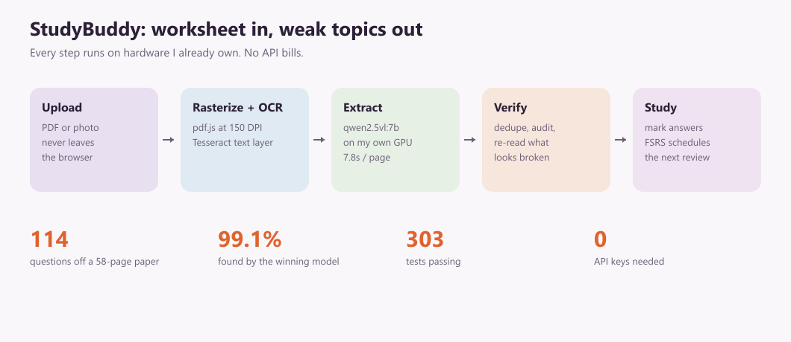
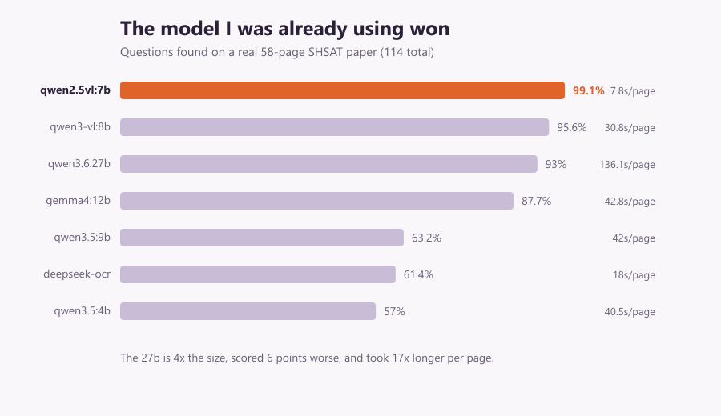

# StudyBuddy devlog

One post covering the whole project. Paste the text below, attach the images in
the order they appear.

**Images ready to attach:** `devlog/media/pipeline.png`,
`devlog/media/benchmark.png`

**Still worth grabbing** (2 minutes, big payoff, since visuals are what make
people stop scrolling): a screenshot of the dashboard with real weak topics, and
a 20 second screen recording of uploading a worksheet and watching questions
appear.

---

# I built a study app that turns homework into a personalised revision plan, and runs the AI on my own gaming laptop

**What it does:** you upload a worksheet or a practice test as a PDF or a photo.
It reads every question off the page, works out which topic each one belongs to,
and after you mark which ones you got wrong it schedules them for review using
FSRS, the same spaced repetition algorithm Anki uses. The dashboard then tells
you which topics you are actually weak at, rather than which ones you feel weak
at.

**The constraint that shaped everything:** I did not want to pay for an API. So
the vision model runs on my own RTX 5080 laptop, which sits at home and polls the
deployed site for jobs. It only ever dials out, so there is no inbound port and
nothing listening on my home network. New accounts get three free worksheets
processed on my hardware. If my laptop is off, uploads queue instead of failing.

## The part I got most wrong

I picked the extraction model, `qwen2.5vl:7b`, because it was the first thing I
pulled. Months later I finally measured it properly: 9 vision models, a real 58
page SHSAT practice test, 114 questions, scored on whether the questions came off
the page intact.

The model I had already been using won. The 27b model, at nearly four times the
size, scored six points **worse** and took 183 seconds per page against 7.8. I
had been quietly assuming for weeks that upgrading would fix my accuracy problems
and it would have made everything 17 times slower for nothing.

Ground truth was free, which I was pleased with: every printed question number
from 1 to 114 should appear exactly once across the paper, so the test grades
itself and I did not have to label 58 pages by hand.

## The bug that was hiding behind the accuracy problem

Then I looked at *which* questions each model missed, and they were not scattered
randomly. They came in blocks. One model dropped 17 consecutive questions.

Every single miss, across every model, turned out to be a page that returned an
**empty response**. Not a question misread, a page that came back with nothing.
One model did this on 14 of its 58 pages.

That was my bug, not the model's. An empty reply produces zero questions and no
error, so my audit, which only checked that the question numbering had no gaps,
saw nothing wrong. The upload reported success while an entire page had silently
vanished. One retry fixed it, with the temperature nudged above zero, because a
greedy model that already chose to emit nothing will make the identical choice
when asked again.

## Other things that broke, in order of how stupid I felt

**A rule that was wrong 25 times out of 25.** I wrote a check to catch questions
that got cut off mid sentence: flag any stem that does not end in punctuation. It
fired on 25 of 114 rows of a *clean* extraction. Real test questions constantly
end with "by" or "through" and are completed by their own answer choices.
Narrowing it to actual cut markers removed every false positive and changed zero
decisions, meaning the rule had been pure noise the entire time. The 7B model I
was using as a second opinion makes the identical mistake, which was oddly
comforting.

**I added rate limiting and immediately locked out my own test suite,** which
signs up far more than five times an hour from localhost.

**One 500 error that was three unrelated bugs stacked on each other:** blob
storage needing a different access mode, an embeddings library dragging a native
runtime into a serverless function that has no such thing, and a signup dead end
where a failed email left the account created but unreachable.

**A double slash in a URL.** Verification emails were pointing at
`host//verify?token=...` because the base URL ended in a slash. Two slashes is
not the same route, and a host that redirects to tidy it can drop the query
string, taking the token with it.

**I deleted my entire email system.** Sending email to real addresses needs a
domain you own so SPF and DKIM records can be published, and a free `.vercel.app`
subdomain cannot carry those. Rather than buy a domain I deleted 274 lines and
made Google sign-in the front door, which already skipped the whole problem.

## A decision I am glad I slowed down on

The AI read one question as two, which inflated the count and pushed every
following number off by one. The obvious fix is to delete rows whose label style
looks wrong. Before writing it I checked against the actual worksheet, and page 4
had legitimate numeric labels: a label only rule would have deleted a real
question. One false positive out of two.

So the merge rule now requires one row's answer choices to be *contained inside*
the other, and it only ever merges pairs. Everywhere else in the pipeline follows
the same principle: flag it, re-read it, never delete a student's work on a guess.

## Where it landed

303 tests passing. The whole thing is Next.js, Postgres with pgvector for topic
matching, Auth.js, and Ollama on my own hardware. The most useful thing I learned
was to measure the distribution and not the average, which bit me twice: once on
that truncation rule, and again when I sized a model's context window off the
average page and nearly truncated exactly the pages carrying the most questions.
